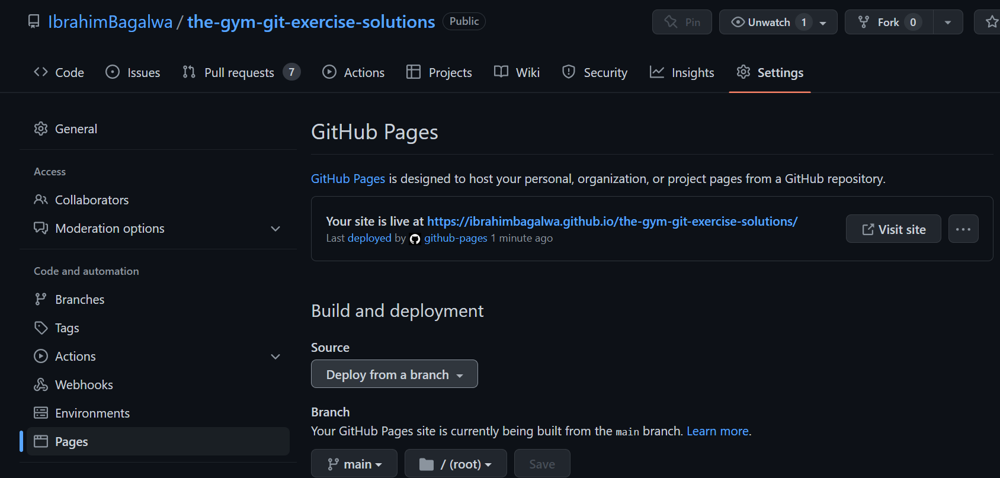
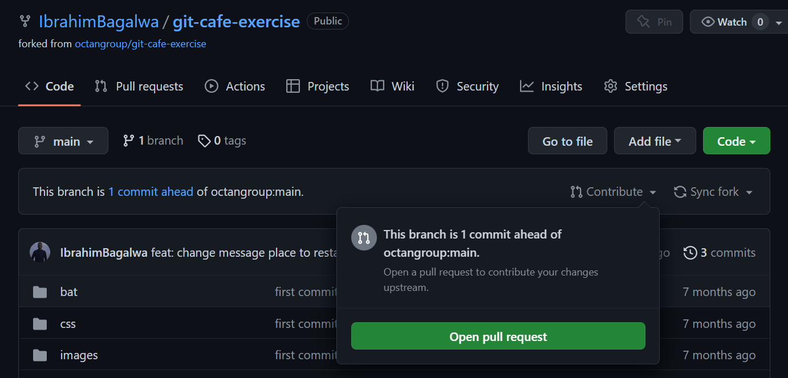
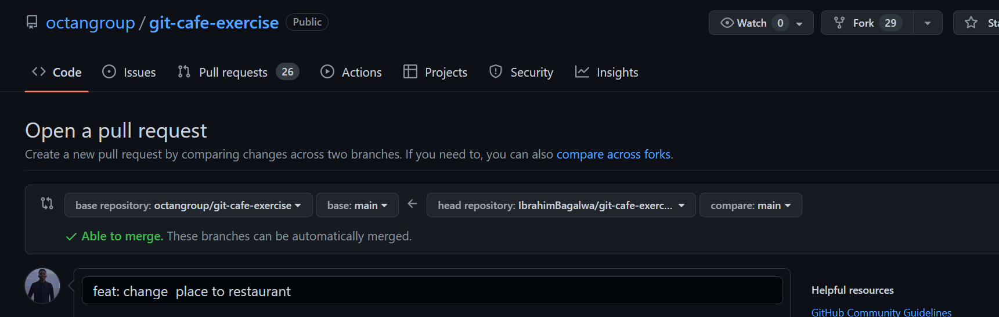

# The Gym Git && Github exercise

## Welcome! 👋

This is a solution to the Gym Traning. The Gym challenge help us to improve our coding skills by building realistic projects.
In this exercise, we will use git and Github command.

## Content

- [the-gym-git-github-exercise](#the-gym-git-github-exercice)
- [Welcome! 👋](#welcome)
- [The challenge](#the-challenge)
- [My process](#my-process)
- [Author](#author)
- [Connect Us:](#connect-us)

### The challenge

Users should be able to:

- Before starting these exercises, please create one github repository that you will use to paste your terminal history into after each exercise,
- Call it “Gym Git Exercise Solutions” or similar. Make sure it has a readme file,
- The process for solving the exercises is as follows:
- First try to solve the exercise on your own (without peaking into the solution!). You are allowed google git commands, if you don’t remember them or if you need to read up on them.
- Next watch the solution video for the exercise you just completed.
- If you feel you may have done some things wrong, do the exercise again. But while you are doing it again, don’t peak at the video. Do it from memory.
- Now you can watch the video again (possibly at double speed, or skipping to the bits that you have doubts about) to double check if you did everything right this time.
- If you feel you still had mistakes, do the exercise again. Again, do it from memory, don’t peak at the video. And then afterwards check the video again etc. etc.
- Once you are confident that you have got the right solution, copy the terminal commands you used in your last try and past them in the readme file of the “Gym Git Exercise Solutions” repository you have created. All Solutions to all exercises should be pasted into the readme file of this repository. Even when an exercise requires you to create a github repository for the purposes of solving the exercise, nevertheless always use the “Gym Git Exercise Solutions” readme file to paste your terminal history into.

## My process

# Bundle 1

## Exercise 1

```bash

TheGym@DESKTOP-8H0OS24 MINGW64 ~/Documents/TheGym-Tasks/Git-Exercice
$ git init
Initialized empty Git repository in C:/Users/TheGym/Documents/TheGym-Tasks/Git-Exercice/.git/

TheGym@DESKTOP-8H0OS24 MINGW64 ~/Documents/TheGym-Tasks/Git-Exercice (master)
$ git branch -M main

TheGym@DESKTOP-8H0OS24 MINGW64 ~/Documents/TheGym-Tasks/Git-Exercice (main)
$ touch README.md

TheGym@DESKTOP-8H0OS24 MINGW64 ~/Documents/TheGym-Tasks/Git-Exercice (main)
$ git add README.md

TheGym@DESKTOP-8H0OS24 MINGW64 ~/Documents/TheGym-Tasks/Git-Exercice (main)
$ git commit -m "feat: initialize readme of gym git exercise"
[main (root-commit) 095f6ea] feat: initialize readme of gym git exercise
 1 file changed, 50 insertions(+)
 create mode 100644 README.md

TheGym@DESKTOP-8H0OS24 MINGW64 ~/Documents/TheGym-Tasks/Git-Exercice (main)
$ git remote add origin https://github.com/IbrahimBagalwa/the-gym-git-exercise-solutions.git

TheGym@DESKTOP-8H0OS24 MINGW64 ~/Documents/TheGym-Tasks/Git-Exercice (main)
$ git push origin main
Enumerating objects: 3, done.
Counting objects: 100% (3/3), done.
Delta compression using up to 4 threads
Compressing objects: 100% (2/2), done.
Writing objects: 100% (3/3), 1.42 KiB | 728.00 KiB/s, done.
Total 3 (delta 0), reused 0 (delta 0), pack-reused 0
To https://github.com/IbrahimBagalwa/the-gym-git-exercise-solutions.git
 * [new branch]      main -> main

TheGym@DESKTOP-8H0OS24 MINGW64 ~/Documents/TheGym-Tasks/Git-Exercice (main)
$ git branch dev

TheGym@DESKTOP-8H0OS24 MINGW64 ~/Documents/TheGym-Tasks/Git-Exercice (main)
$ git checkout dev
Switched to branch 'dev'

TheGym@DESKTOP-8H0OS24 MINGW64 ~/Documents/TheGym-Tasks/Git-Exercice (dev)
$ git push origin dev
Total 0 (delta 0), reused 0 (delta 0), pack-reused 0
remote:
remote: Create a pull request for 'dev' on GitHub by visiting:
remote:      https://github.com/IbrahimBagalwa/the-gym-git-exercise-solutions/pull/new/dev
remote:
To https://github.com/IbrahimBagalwa/the-gym-git-exercise-solutions.git
 * [new branch]      dev -> dev

TheGym@DESKTOP-8H0OS24 MINGW64 ~/Documents/TheGym-Tasks/Git-Exercice (dev)
$ git branch test

TheGym@DESKTOP-8H0OS24 MINGW64 ~/Documents/TheGym-Tasks/Git-Exercice (dev)
$ git checkout test
Switched to branch 'test'

TheGym@DESKTOP-8H0OS24 MINGW64 ~/Documents/TheGym-Tasks/Git-Exercice (test)
$ git push origin test
Total 0 (delta 0), reused 0 (delta 0), pack-reused 0
remote:
remote: Create a pull request for 'test' on GitHub by visiting:
remote:      https://github.com/IbrahimBagalwa/the-gym-git-exercise-solutions/pull/new/test
remote:
To https://github.com/IbrahimBagalwa/the-gym-git-exercise-solutions.git
 * [new branch]      test -> test

TheGym@DESKTOP-8H0OS24 MINGW64 ~/Documents/TheGym-Tasks/Git-Exercice (test)
$ git checkout dev
Switched to branch 'dev'

TheGym@DESKTOP-8H0OS24 MINGW64 ~/Documents/TheGym-Tasks/Git-Exercice (dev)
$ git branch -d test
Deleted branch test (was 095f6ea).

TheGym@DESKTOP-8H0OS24 MINGW64 ~/Documents/TheGym-Tasks/Git-Exercice (dev)
$ git push origin dev
Everything up-to-date

TheGym@DESKTOP-8H0OS24 MINGW64 ~/Documents/TheGym-Tasks/Git-Exercice (dev)
$ git push origin --delete test
To https://github.com/IbrahimBagalwa/the-gym-git-exercise-solutions.git
 - [deleted]         test

TheGym@DESKTOP-8H0OS24 MINGW64 ~/Documents/TheGym-Tasks/Git-Exercice (dev)
$
```

## Exercise 2

```bash
TheGym@DESKTOP-8H0OS24 MINGW64 ~/Documents/TheGym-Tasks/Git-Exercice (dev)
$ touch home.html

TheGym@DESKTOP-8H0OS24 MINGW64 ~/Documents/TheGym-Tasks/Git-Exercice (dev)
$ git add .

TheGym@DESKTOP-8H0OS24 MINGW64 ~/Documents/TheGym-Tasks/Git-Exercice (dev)
$ git stash
Saved working directory and index state WIP on dev: 8ef3bf9 feat: add command for exercice 1

TheGym@DESKTOP-8H0OS24 MINGW64 ~/Documents/TheGym-Tasks/Git-Exercice (dev)
$ git stash list
stash@{0}: WIP on dev: 8ef3bf9 feat: add command for exercice 1

TheGym@DESKTOP-8H0OS24 MINGW64 ~/Documents/TheGym-Tasks/Git-Exercice (dev)
$ touch about.html

TheGym@DESKTOP-8H0OS24 MINGW64 ~/Documents/TheGym-Tasks/Git-Exercice (dev)
$ git add .

TheGym@DESKTOP-8H0OS24 MINGW64 ~/Documents/TheGym-Tasks/Git-Exercice (dev)
$ git stash
Saved working directory and index state WIP on dev: 8ef3bf9 feat: add command for exercice 1

TheGym@DESKTOP-8H0OS24 MINGW64 ~/Documents/TheGym-Tasks/Git-Exercice (dev)
$ git stash list
stash@{0}: WIP on dev: 8ef3bf9 feat: add command for exercice 1
stash@{1}: WIP on dev: 8ef3bf9 feat: add command for exercice 1

TheGym@DESKTOP-8H0OS24 MINGW64 ~/Documents/TheGym-Tasks/Git-Exercice (dev)
$ touch team.html

TheGym@DESKTOP-8H0OS24 MINGW64 ~/Documents/TheGym-Tasks/Git-Exercice (dev)
$ git add team.html

TheGym@DESKTOP-8H0OS24 MINGW64 ~/Documents/TheGym-Tasks/Git-Exercice (dev)
$ git add team.html

TheGym@DESKTOP-8H0OS24 MINGW64 ~/Documents/TheGym-Tasks/Git-Exercice (dev)
$ git stash
Saved working directory and index state WIP on dev: 8ef3bf9 feat: add command for exercice 1

TheGym@DESKTOP-8H0OS24 MINGW64 ~/Documents/TheGym-Tasks/Git-Exercice (dev)
$ git stah list
git: 'stah' is not a git command. See 'git --help'.

The most similar command is
        stash

TheGym@DESKTOP-8H0OS24 MINGW64 ~/Documents/TheGym-Tasks/Git-Exercice (dev)
$ git stash list
stash@{0}: WIP on dev: 8ef3bf9 feat: add command for exercice 1
stash@{1}: WIP on dev: 8ef3bf9 feat: add command for exercice 1
stash@{2}: WIP on dev: 8ef3bf9 feat: add command for exercice 1

TheGym@DESKTOP-8H0OS24 MINGW64 ~/Documents/TheGym-Tasks/Git-Exercice (dev)
$ git stash pop stash@{1}
On branch dev
Changes to be committed:
  (use "git restore --staged <file>..." to unstage)
        new file:   about.html

Dropped stash@{1} (8fa6eca6de9e7074aa37b1f49c0ad9d47dfd603e)

TheGym@DESKTOP-8H0OS24 MINGW64 ~/Documents/TheGym-Tasks/Git-Exercice (dev)
$ git stash list
stash@{0}: WIP on dev: 8ef3bf9 feat: add command for exercice 1
stash@{1}: WIP on dev: 8ef3bf9 feat: add command for exercice 1

TheGym@DESKTOP-8H0OS24 MINGW64 ~/Documents/TheGym-Tasks/Git-Exercice (dev)
$ git stash pop stash@{1}
On branch dev
Changes to be committed:
  (use "git restore --staged <file>..." to unstage)
        new file:   about.html
        new file:   home.html

Changes not staged for commit:
  (use "git add <file>..." to update what will be committed)
  (use "git restore <file>..." to discard changes in working directory)
        modified:   README.md

Dropped stash@{1} (07e1df371f33b313fba5ca054cd57211a28e8dea)

TheGym@DESKTOP-8H0OS24 MINGW64 ~/Documents/TheGym-Tasks/Git-Exercice (dev)
$ git add .

TheGym@DESKTOP-8H0OS24 MINGW64 ~/Documents/TheGym-Tasks/Git-Exercice (dev)
$ git commit -m "feat: exercice 2 deal with stash"
[dev f363eb0] feat: exercice 2 deal with stash
 3 files changed, 28 insertions(+)
 create mode 100644 about.html
 create mode 100644 home.html

TheGym@DESKTOP-8H0OS24 MINGW64 ~/Documents/TheGym-Tasks/Git-Exercice (dev)
$ git push origin dev
Enumerating objects: 10, done.
Counting objects: 100% (10/10), done.
Delta compression using up to 4 threads
Compressing objects: 100% (7/7), done.
Writing objects: 100% (8/8), 2.63 KiB | 1.32 MiB/s, done.
Total 8 (delta 2), reused 0 (delta 0), pack-reused 0
remote: Resolving deltas: 100% (2/2), done.
To https://github.com/IbrahimBagalwa/the-gym-git-exercise-solutions.git
   095f6ea..f363eb0  dev -> dev

TheGym@DESKTOP-8H0OS24 MINGW64 ~/Documents/TheGym-Tasks/Git-Exercice (dev)
$ git stash apply
On branch dev
Changes to be committed:
  (use "git restore --staged <file>..." to unstage)
        new file:   team.html


TheGym@DESKTOP-8H0OS24 MINGW64 ~/Documents/TheGym-Tasks/Git-Exercice (dev)
$ git reset --hard
HEAD is now at f363eb0 feat: exercice 2 deal with stash

TheGym@DESKTOP-8H0OS24 MINGW64 ~/Documents/TheGym-Tasks/Git-Exercice (dev)
$
```

# Bundle 2

## Exercise 1

```bash
TheGym@DESKTOP-8H0OS24 MINGW64 ~/Documents/TheGym-Tasks/Git-Exercice (dev)
$ git branch ft/bundle-2

TheGym@DESKTOP-8H0OS24 MINGW64 ~/Documents/TheGym-Tasks/Git-Exercice (dev)
$ git checkout ft/bundle-2
Switched to branch 'ft/bundle-2'

TheGym@DESKTOP-8H0OS24 MINGW64 ~/Documents/TheGym-Tasks/Git-Exercice (ft/bundle-2)
$ touch services.html

TheGym@DESKTOP-8H0OS24 MINGW64 ~/Documents/TheGym-Tasks/Git-Exercice (ft/bundle-2)
$ git add services.html

TheGym@DESKTOP-8H0OS24 MINGW64 ~/Documents/TheGym-Tasks/Git-Exercice (ft/bundle-2)
$ git commit -m "feat: bundle-2 exercise 1"
[ft/bundle-2 1c4afe2] feat: bundle-2 exercise 1
 1 file changed, 12 insertions(+)
 create mode 100644 services.html

TheGym@DESKTOP-8H0OS24 MINGW64 ~/Documents/TheGym-Tasks/Git-Exercice (ft/bundle-2)
$ git push origin ft/bundle-2
Enumerating objects: 4, done.
Counting objects: 100% (4/4), done.
Delta compression using up to 4 threads
Compressing objects: 100% (3/3), done.
Writing objects: 100% (3/3), 490 bytes | 245.00 KiB/s, done.
Total 3 (delta 1), reused 0 (delta 0), pack-reused 0
remote: Resolving deltas: 100% (1/1), completed with 1 local object.
remote:
remote: Create a pull request for 'ft/bundle-2' on GitHub by visiting:
remote:      https://github.com/IbrahimBagalwa/the-gym-git-exercise-solutions/pull/new/ft/bundle-2
remote:
To https://github.com/IbrahimBagalwa/the-gym-git-exercise-solutions.git
 * [new branch]      ft/bundle-2 -> ft/bundle-2

TheGym@DESKTOP-8H0OS24 MINGW64 ~/Documents/TheGym-Tasks/Git-Exercice (ft/bundle-2)
$
```

## Exercice 2

```bash

TheGym@DESKTOP-8H0OS24 MINGW64 ~/Documents/TheGym-Tasks/Git-Exercice (ft/bundle-2)
$ git checkout main
Switched to branch 'main'

TheGym@DESKTOP-8H0OS24 MINGW64 ~/Documents/TheGym-Tasks/Git-Exercice (main)
$ git pull origin ft/bundle-2
From https://github.com/IbrahimBagalwa/the-gym-git-exercise-solutions
 * branch            ft/bundle-2 -> FETCH_HEAD
Updating 095f6ea..00c991d
Fast-forward
 README.md     | 259 ++++++++++++++++++++++++++++++++++++++++++++++++++++++++++
 about.html    |  12 +++
 home.html     |  10 +++
 services.html |  12 +++
 4 files changed, 293 insertions(+)
 create mode 100644 about.html
 create mode 100644 home.html
 create mode 100644 services.html

TheGym@DESKTOP-8H0OS24 MINGW64 ~/Documents/TheGym-Tasks/Git-Exercice (main)
$ git branch ft/service-redesign

TheGym@DESKTOP-8H0OS24 MINGW64 ~/Documents/TheGym-Tasks/Git-Exercice (main)
$ git checkout ft/service-redesign
Switched to branch 'ft/service-redesign'

TheGym@DESKTOP-8H0OS24 MINGW64 ~/Documents/TheGym-Tasks/Git-Exercice (ft/service-redesign)
$ git add .

TheGym@DESKTOP-8H0OS24 MINGW64 ~/Documents/TheGym-Tasks/Git-Exercice (ft/service-redesign)
$ git commit -m "fix: services page"
[ft/service-redesign 900bf38] fix: services page
 1 file changed, 8 insertions(+)

TheGym@DESKTOP-8H0OS24 MINGW64 ~/Documents/TheGym-Tasks/Git-Exercice (ft/service-redesign)
$ git push origin ft/service-redesign
Enumerating objects: 5, done.
Counting objects: 100% (5/5), done.
Delta compression using up to 4 threads
Compressing objects: 100% (3/3), done.
Writing objects: 100% (3/3), 515 bytes | 257.00 KiB/s, done.
Total 3 (delta 1), reused 0 (delta 0), pack-reused 0
remote: Resolving deltas: 100% (1/1), completed with 1 local object.
remote:
remote: Create a pull request for 'ft/service-redesign' on GitHub by visiting:
remote:      https://github.com/IbrahimBagalwa/the-gym-git-exercise-solutions/pull/new/ft/service-redesign
remote:
To https://github.com/IbrahimBagalwa/the-gym-git-exercise-solutions.git
 * [new branch]      ft/service-redesign -> ft/service-redesign

TheGym@DESKTOP-8H0OS24 MINGW64 ~/Documents/TheGym-Tasks/Git-Exercice (ft/service-redesign)
$ git checkout main
Switched to branch 'main'

TheGym@DESKTOP-8H0OS24 MINGW64 ~/Documents/TheGym-Tasks/Git-Exercice (main)
$ git add .

TheGym@DESKTOP-8H0OS24 MINGW64 ~/Documents/TheGym-Tasks/Git-Exercice (main)
$ git commit -m "feat: main services update"
[main 6e43016] feat: main services update
 1 file changed, 9 insertions(+), 1 deletion(-)

 $ git push origin main
Enumerating objects: 6, done.
Counting objects: 100% (6/6), done.
Delta compression using up to 4 threads
Compressing objects: 100% (4/4), done.
Writing objects: 100% (4/4), 705 bytes | 352.00 KiB/s, done.
Total 4 (delta 2), reused 0 (delta 0), pack-reused 0
remote: Resolving deltas: 100% (2/2), completed with 1 local object.
To https://github.com/IbrahimBagalwa/the-gym-git-exercise-solutions.git
   ded7bb9..2a0801f  main -> main

TheGym@DESKTOP-8H0OS24 MINGW64 ~/Documents/TheGym-Tasks/Git-Exercice (main)
$ git checkout ft/service-redesign
Switched to branch 'ft/service-redesign'

TheGym@DESKTOP-8H0OS24 MINGW64 ~/Documents/TheGym-Tasks/Git-Exercice (ft/service-redesign)
$ git merge main
Auto-merging services.html
CONFLICT (content): Merge conflict in services.html
Automatic merge failed; fix conflicts and then commit the result.
TheGym@DESKTOP-8H0OS24 MINGW64 ~/Documents/TheGym-Tasks/Git-Exercice (ft/service-redesign|MERGING)
$ git diff
diff --cc services.html
index 56bb237,0ee3f7e..0000000
--- a/services.html
+++ b/services.html
@@@ -7,13 -7,13 +7,23 @@@
      <title>Git-Exercice</title>
    </head>
    <body>
++<<<<<<< HEAD
 +    <h1>Services</h1>
 +    <div class="container">
 +      <div class="content">
 +        <div class="item">1</div>
 +        <div class="item">2</div>
 +        <div class="item">3</div>
 +        <div class="item">4</div>
++=======
+     <h1>Services main branch</h1>
+     <div class="container">
+       <div class="content">
+         <div class="item">item 1</div>
+         <div class="item">item 2</div>
+         <div class="item">item 3</div>
+         <div class="item">item 4</div>
++>>>>>>> main
        </div>
      </div>
    </body>

TheGym@DESKTOP-8H0OS24 MINGW64 ~/Documents/TheGym-Tasks/Git-Exercice (ft/service-redesign|MERGING)
$ git add services.html

TheGym@DESKTOP-8H0OS24 MINGW64 ~/Documents/TheGym-Tasks/Git-Exercice (ft/service-redesign|MERGING)
$ git commit -m " fix: conflit has fixed succefully"
[ft/service-redesign 84e352f]  fix: conflit has fixed succefully

TheGym@DESKTOP-8H0OS24 MINGW64 ~/Documents/TheGym-Tasks/Git-Exercice (ft/service-redesign)
$ git push origin ft/service-redesign
Enumerating objects: 7, done.
Counting objects: 100% (7/7), done.
Delta compression using up to 4 threads
Compressing objects: 100% (3/3), done.
Writing objects: 100% (3/3), 389 bytes | 194.00 KiB/s, done.
Total 3 (delta 2), reused 0 (delta 0), pack-reused 0
remote: Resolving deltas: 100% (2/2), completed with 2 local objects.
To https://github.com/IbrahimBagalwa/the-gym-git-exercise-solutions.git
   900bf38..84e352f  ft/service-redesign -> ft/service-redesign

TheGym@DESKTOP-8H0OS24 MINGW64 ~/Documents/TheGym-Tasks/Git-Exercice (ft/service-redesign)
$
```

# Bundle 3

## Exercise 1

```bash
TheGym@DESKTOP-8H0OS24 MINGW64 ~/Documents/TheGym-Tasks/Git-Exercice (ft/service-redesign)
$ git branch ft/team-page

TheGym@DESKTOP-8H0OS24 MINGW64 ~/Documents/TheGym-Tasks/Git-Exercice (ft/service-redesign)
$ git checkout ft/team-page
Switched to branch 'ft/team-page'
M       README.md

TheGym@DESKTOP-8H0OS24 MINGW64 ~/Documents/TheGym-Tasks/Git-Exercice (ft/team-page)
$ touch team.html

TheGym@DESKTOP-8H0OS24 MINGW64 ~/Documents/TheGym-Tasks/Git-Exercice (ft/team-page)
$ git add team.html

TheGym@DESKTOP-8H0OS24 MINGW64 ~/Documents/TheGym-Tasks/Git-Exercice (ft/team-page)
$ git commit -m "feat: team page created"
[ft/team-page 63301e3] feat: team page created
 1 file changed, 12 insertions(+)
 create mode 100644 team.html

TheGym@DESKTOP-8H0OS24 MINGW64 ~/Documents/TheGym-Tasks/Git-Exercice (ft/team-page)
$ git push origin ft/team-page
Enumerating objects: 4, done.
Counting objects: 100% (4/4), done.
Delta compression using up to 4 threads
Compressing objects: 100% (3/3), done.
Writing objects: 100% (3/3), 487 bytes | 243.00 KiB/s, done.
Total 3 (delta 1), reused 0 (delta 0), pack-reused 0
remote: Resolving deltas: 100% (1/1), completed with 1 local object.
remote:
remote: Create a pull request for 'ft/team-page' on GitHub by visiting:
remote:      https://github.com/IbrahimBagalwa/the-gym-git-exercise-solutions/pull/new/ft/team-page
remote:
To https://github.com/IbrahimBagalwa/the-gym-git-exercise-solutions.git
 * [new branch]      ft/team-page -> ft/team-page

TheGym@DESKTOP-8H0OS24 MINGW64 ~/Documents/TheGym-Tasks/Git-Exercice (ft/team-page)
$ git checkout main
Switched to branch 'main'
M       README.md

TheGym@DESKTOP-8H0OS24 MINGW64 ~/Documents/TheGym-Tasks/Git-Exercice (main)
$ git branch ft/contact-page

TheGym@DESKTOP-8H0OS24 MINGW64 ~/Documents/TheGym-Tasks/Git-Exercice (main)
$ git checkout main
Already on 'main'
M       README.md

TheGym@DESKTOP-8H0OS24 MINGW64 ~/Documents/TheGym-Tasks/Git-Exercice (main)
$ git checkout ft/team-page
Switched to branch 'ft/team-page'
M       README.md

TheGym@DESKTOP-8H0OS24 MINGW64 ~/Documents/TheGym-Tasks/Git-Exercice (ft/team-page)
$ git log
commit 63301e3294e7cc218d92eddf0134e6255264382d (HEAD -> ft/team-page, origin/ft/team-page)
Author: IbrahimBagalwa <bagmurhulaibrahim@gmail.com>
Date:   Thu Nov 10 10:45:53 2022 +0200

    feat: team page created

commit 84e352f3ffd75cccfa97df258675171d74878bc9 (origin/ft/service-redesign, ft/service-redesign)
Merge: 900bf38 2a0801f
Author: IbrahimBagalwa <bagmurhulaibrahim@gmail.com>
Date:   Thu Nov 10 10:30:35 2022 +0200

     fix: conflit has fixed succefully

commit 2a0801f57b167c7382e096c9d95a65d9a9d55a68 (origin/main, main, ft/contact-page)
Merge: 6e43016 ded7bb9
Author: IbrahimBagalwa <bagmurhulaibrahim@gmail.com>
Date:   Thu Nov 10 09:43:31 2022 +0200

TheGym@DESKTOP-8H0OS24 MINGW64 ~/Documents/TheGym-Tasks/Git-Exercice (ft/team-page)
$ git checkout ft/contact-page
Switched to branch 'ft/contact-page'
M       README.md

TheGym@DESKTOP-8H0OS24 MINGW64 ~/Documents/TheGym-Tasks/Git-Exercice (ft/contact-page)
$ git cherry-pick 63301e3294e7cc218d92eddf0134e6255264382d101
fatal: bad revision '63301e3294e7cc218d92eddf0134e6255264382d101'

TheGym@DESKTOP-8H0OS24 MINGW64 ~/Documents/TheGym-Tasks/Git-Exercice (ft/team-page)
$ git log --oneline
63301e3 (HEAD -> ft/team-page, origin/ft/team-page) feat: team page created
84e352f (origin/ft/service-redesign, ft/service-redesign)  fix: conflit has fixed succefully
2a0801f (origin/main, main, ft/contact-page) Merge branch 'main' of https://github.com/IbrahimBagalwa/the-gym-git-exercise-solutions
6e43016 feat: main services update
900bf38 fix: services page
ded7bb9 Merge pull request #1 from IbrahimBagalwa/ft/bundle-2
00c991d (origin/ft/bundle-2, ft/bundle-2) feat add command for bundle2 exercice1 in readme file
1c4afe2 feat: bundle-2 exercise 1
fd9c7ed (origin/dev, dev) feat: bundle 1 done
f363eb0 feat: exercice 2 deal with stash
8ef3bf9 feat: add command for exercice 1
095f6ea feat: initialize readme of gym git exercise

TheGym@DESKTOP-8H0OS24 MINGW64 ~/Documents/TheGym-Tasks/Git-Exercice (ft/team-page)
$ git checkout ft/contact-page
Switched to branch 'ft/contact-page'
M       README.md

TheGym@DESKTOP-8H0OS24 MINGW64 ~/Documents/TheGym-Tasks/Git-Exercice (ft/contact-page)
$ git cherry-pick 63301e3
[ft/contact-page 07a8f7a] feat: team page created
 Date: Thu Nov 10 10:45:53 2022 +0200
 1 file changed, 12 insertions(+)
 create mode 100644 team.html

TheGym@DESKTOP-8H0OS24 MINGW64 ~/Documents/TheGym-Tasks/Git-Exercice (ft/contact-page)
$ touch contact.html

TheGym@DESKTOP-8H0OS24 MINGW64 ~/Documents/TheGym-Tasks/Git-Exercice (ft/contact-page)
$ git add contact.html

TheGym@DESKTOP-8H0OS24 MINGW64 ~/Documents/TheGym-Tasks/Git-Exercice (ft/contact-page)
$ git commit -m "feat: contact page"
[ft/contact-page 6975f08] feat: contact page
 1 file changed, 12 insertions(+)
 create mode 100644 contact.html

TheGym@DESKTOP-8H0OS24 MINGW64 ~/Documents/TheGym-Tasks/Git-Exercice (ft/contact-page)
$ git push origin ft/contact-page
Enumerating objects: 7, done.
Counting objects: 100% (7/7), done.
Delta compression using up to 4 threads
Compressing objects: 100% (6/6), done.
Writing objects: 100% (6/6), 761 bytes | 380.00 KiB/s, done.
Total 6 (delta 3), reused 0 (delta 0), pack-reused 0
remote: Resolving deltas: 100% (3/3), completed with 1 local object.
remote:
remote: Create a pull request for 'ft/contact-page' on GitHub by visiting:
remote:      https://github.com/IbrahimBagalwa/the-gym-git-exercise-solutions/pull/new/ft/contact-page
remote:
To https://github.com/IbrahimBagalwa/the-gym-git-exercise-solutions.git
 * [new branch]      ft/contact-page -> ft/contact-page

TheGym@DESKTOP-8H0OS24 MINGW64 ~/Documents/TheGym-Tasks/Git-Exercice (ft/contact-page)
$ git branch ft/faq-page

TheGym@DESKTOP-8H0OS24 MINGW64 ~/Documents/TheGym-Tasks/Git-Exercice (ft/contact-page)
$ git checkout ft/faq-page
Switched to branch 'ft/faq-page'
M       README.md

TheGym@DESKTOP-8H0OS24 MINGW64 ~/Documents/TheGym-Tasks/Git-Exercice (ft/faq-page)
$ touch faq.html

TheGym@DESKTOP-8H0OS24 MINGW64 ~/Documents/TheGym-Tasks/Git-Exercice (ft/faq-page)
$ git add .

TheGym@DESKTOP-8H0OS24 MINGW64 ~/Documents/TheGym-Tasks/Git-Exercice (ft/faq-page)
$ git commit -m "feat: faq page created"
[ft/faq-page f73e6b7] feat: faq page created
 2 files changed, 152 insertions(+)
 create mode 100644 faq.html

TheGym@DESKTOP-8H0OS24 MINGW64 ~/Documents/TheGym-Tasks/Git-Exercice (ft/faq-page)
$ git push origin ft/faq-page
Enumerating objects: 6, done.
Counting objects: 100% (6/6), done.
Delta compression using up to 4 threads
Compressing objects: 100% (4/4), done.
Writing objects: 100% (4/4), 1.59 KiB | 813.00 KiB/s, done.
Total 4 (delta 2), reused 0 (delta 0), pack-reused 0
remote: Resolving deltas: 100% (2/2), completed with 2 local objects.
remote:
remote: Create a pull request for 'ft/faq-page' on GitHub by visiting:
remote:      https://github.com/IbrahimBagalwa/the-gym-git-exercise-solutions/pull/new/ft/faq-page
remote:
To https://github.com/IbrahimBagalwa/the-gym-git-exercise-solutions.git
 * [new branch]      ft/faq-page -> ft/faq-page

TheGym@DESKTOP-8H0OS24 MINGW64 ~/Documents/TheGym-Tasks/Git-Exercice (ft/faq-page)
$ git revert 63301e3
[ft/faq-page 862dc22] Revert "feat: team page created"
 1 file changed, 12 deletions(-)
 delete mode 100644 team.html

TheGym@DESKTOP-8H0OS24 MINGW64 ~/Documents/TheGym-Tasks/Git-Exercice (ft/faq-page)
$ git push origin ft/faq-page
Enumerating objects: 3, done.
Counting objects: 100% (3/3), done.
Delta compression using up to 4 threads
Compressing objects: 100% (2/2), done.
Writing objects: 100% (2/2), 283 bytes | 141.00 KiB/s, done.
Total 2 (delta 1), reused 0 (delta 0), pack-reused 0
remote: Resolving deltas: 100% (1/1), completed with 1 local object.
To https://github.com/IbrahimBagalwa/the-gym-git-exercise-solutions.git
   f73e6b7..862dc22  ft/faq-page -> ft/faq-page

TheGym@DESKTOP-8H0OS24 MINGW64 ~/Documents/TheGym-Tasks/Git-Exercice (ft/faq-page)
$
```

## Exercise 2

```bash
TheGym@DESKTOP-8H0OS24 MINGW64 ~/Documents/TheGym-Tasks/Git-Exercice (ft/faq-page)
$ git branch ft/home-page-redesign

TheGym@DESKTOP-8H0OS24 MINGW64 ~/Documents/TheGym-Tasks/Git-Exercice (ft/faq-page)
$ git checkout ft/home-page-redesign
Switched to branch 'ft/home-page-redesign'
M       README.md

TheGym@DESKTOP-8H0OS24 MINGW64 ~/Documents/TheGym-Tasks/Git-Exercice (ft/home-page-redesign)
$ git checkout main
Switched to branch 'main'

TheGym@DESKTOP-8H0OS24 MINGW64 ~/Documents/TheGym-Tasks/Git-Exercice (main)
$ git add .

TheGym@DESKTOP-8H0OS24 MINGW64 ~/Documents/TheGym-Tasks/Git-Exercice (main)
$ git commit -m "feat:apply changes in home page"
[main fa8f2cf] feat:apply changes in home page
 1 file changed, 7 insertions(+), 1 deletion(-)

TheGym@DESKTOP-8H0OS24 MINGW64 ~/Documents/TheGym-Tasks/Git-Exercice (main)
$ git push origin main
Enumerating objects: 5, done.
Counting objects: 100% (5/5), done.
Delta compression using up to 4 threads
Compressing objects: 100% (3/3), done.
Writing objects: 100% (3/3), 583 bytes | 291.00 KiB/s, done.
Total 3 (delta 1), reused 0 (delta 0), pack-reused 0
remote: Resolving deltas: 100% (1/1), completed with 1 local object.
To https://github.com/IbrahimBagalwa/the-gym-git-exercise-solutions.git
   2a0801f..fa8f2cf  main -> main

TheGym@DESKTOP-8H0OS24 MINGW64 ~/Documents/TheGym-Tasks/Git-Exercice (main)
$ git checkout ft/home-page-redesign
Switched to branch 'ft/home-page-redesign'

TheGym@DESKTOP-8H0OS24 MINGW64 ~/Documents/TheGym-Tasks/Git-Exercice (ft/home-page-redesign)
$ git rebese main
git: 'rebese' is not a git command. See 'git --help'.

The most similar command is
        rebase

TheGym@DESKTOP-8H0OS24 MINGW64 ~/Documents/TheGym-Tasks/Git-Exercice (ft/home-page-redesign)
$ git rebase main
Successfully rebased and updated refs/heads/ft/home-page-redesign.

TheGym@DESKTOP-8H0OS24 MINGW64 ~/Documents/TheGym-Tasks/Git-Exercice (ft/home-page-redesign)
$ git add .

TheGym@DESKTOP-8H0OS24 MINGW64 ~/Documents/TheGym-Tasks/Git-Exercice (ft/home-page-redesign)
$ git commit -m "feat: redesign the home page"
[ft/home-page-redesign 3c61333] feat: redesign the home page
 1 file changed, 2 insertions(+)

TheGym@DESKTOP-8H0OS24 MINGW64 ~/Documents/TheGym-Tasks/Git-Exercice (ft/home-page-redesign)
$ git push origin ft/home-page-redesign
Enumerating objects: 21, done.
Counting objects: 100% (21/21), done.
Delta compression using up to 4 threads
Compressing objects: 100% (18/18), done.
Writing objects: 100% (18/18), 6.15 KiB | 1.54 MiB/s, done.
Total 18 (delta 9), reused 0 (delta 0), pack-reused 0
remote: Resolving deltas: 100% (9/9), completed with 1 local object.
remote:
remote: Create a pull request for 'ft/home-page-redesign' on GitHub by visiting:
remote:      https://github.com/IbrahimBagalwa/the-gym-git-exercise-solutions/pull/new/ft/home-page-redesign
remote:
To https://github.com/IbrahimBagalwa/the-gym-git-exercise-solutions.git
 * [new branch]      ft/home-page-redesign -> ft/home-page-redesign

TheGym@DESKTOP-8H0OS24 MINGW64 ~/Documents/TheGym-Tasks/Git-Exercice (ft/home-page-redesign)
$
```

# Bundle 4

## Exercise 1

```bash
TheGym@DESKTOP-8H0OS24 MINGW64 ~/Documents/TheGym-Tasks/Git-Exercice (ft/home-page-redesign)
$ git checkout main
Switched to branch 'main'

TheGym@DESKTOP-8H0OS24 MINGW64 ~/Documents/TheGym-Tasks/Git-Exercice (main)
$ git remote add git-copy https://github.com/IbrahimBagalwa/the-gym-git-exercice-2rep.git

TheGym@DESKTOP-8H0OS24 MINGW64 ~/Documents/TheGym-Tasks/Git-Exercice (main)
$ git add .

TheGym@DESKTOP-8H0OS24 MINGW64 ~/Documents/TheGym-Tasks/Git-Exercice (main)
$ git commit -m "feat: create git-copy and modify home page"
[main 6c3f80e] feat: create git-copy and modify home page
 1 file changed, 5 insertions(+)

TheGym@DESKTOP-8H0OS24 MINGW64 ~/Documents/TheGym-Tasks/Git-Exercice (main)
$ git push origin main
Enumerating objects: 5, done.
Counting objects: 100% (5/5), done.
Delta compression using up to 4 threads
Compressing objects: 100% (3/3), done.
Writing objects: 100% (3/3), 442 bytes | 221.00 KiB/s, done.
Total 3 (delta 2), reused 0 (delta 0), pack-reused 0
remote: Resolving deltas: 100% (2/2), completed with 2 local objects.
To https://github.com/IbrahimBagalwa/the-gym-git-exercise-solutions.git
   fa8f2cf..6c3f80e  main -> main

TheGym@DESKTOP-8H0OS24 MINGW64 ~/Documents/TheGym-Tasks/Git-Exercice (main)
$ git push git-copy
Enumerating objects: 31, done.
Counting objects: 100% (31/31), done.
Delta compression using up to 4 threads
Compressing objects: 100% (29/29), done.
Writing objects: 100% (31/31), 6.57 KiB | 961.00 KiB/s, done.
Total 31 (delta 12), reused 0 (delta 0), pack-reused 0
remote: Resolving deltas: 100% (12/12), done.
To https://github.com/IbrahimBagalwa/the-gym-git-exercice-2rep.git
 * [new branch]      main -> main

TheGym@DESKTOP-8H0OS24 MINGW64 ~/Documents/TheGym-Tasks/Git-Exercice (main)
$
```

## Exercise 2

```bash

TheGym@DESKTOP-8H0OS24 MINGW64 ~/Documents/TheGym-Tasks/Git-Exercice (main)
$ git branch ft/footer

TheGym@DESKTOP-8H0OS24 MINGW64 ~/Documents/TheGym-Tasks/Git-Exercice (main)
$ git checkout ft/
ft/bundle-2             ft/faq-page             ft/home-page-redesign   ft/team-page
ft/contact-page         ft/footer               ft/service-redesign

TheGym@DESKTOP-8H0OS24 MINGW64 ~/Documents/TheGym-Tasks/Git-Exercice (main)
$ git checkout ft/footer
Switched to branch 'ft/footer'

TheGym@DESKTOP-8H0OS24 MINGW64 ~/Documents/TheGym-Tasks/Git-Exercice (ft/footer)
$ touch footer.html

TheGym@DESKTOP-8H0OS24 MINGW64 ~/Documents/TheGym-Tasks/Git-Exercice (ft/footer)
$ git add .

TheGym@DESKTOP-8H0OS24 MINGW64 ~/Documents/TheGym-Tasks/Git-Exercice (ft/footer)
$ git commit -m "feat: add first change to our footer"
[ft/footer 037319c] feat: add first change to our footer
 1 file changed, 18 insertions(+)
 create mode 100644 footer.html

TheGym@DESKTOP-8H0OS24 MINGW64 ~/Documents/TheGym-Tasks/Git-Exercice (ft/footer)
$ git add .

TheGym@DESKTOP-8H0OS24 MINGW64 ~/Documents/TheGym-Tasks/Git-Exercice (ft/footer)
$ git commit -m "feat: other commit"
[ft/footer 7941b1c] feat: other commit
 1 file changed, 6 insertions(+)

TheGym@DESKTOP-8H0OS24 MINGW64 ~/Documents/TheGym-Tasks/Git-Exercice (ft/footer)
$ git push origin ft/footer
Enumerating objects: 7, done.
Counting objects: 100% (7/7), done.
Delta compression using up to 4 threads
Compressing objects: 100% (6/6), done.
Writing objects: 100% (6/6), 990 bytes | 495.00 KiB/s, done.
Total 6 (delta 3), reused 0 (delta 0), pack-reused 0
remote: Resolving deltas: 100% (3/3), completed with 1 local object.
remote:
remote: Create a pull request for 'ft/footer' on GitHub by visiting:
remote:      https://github.com/IbrahimBagalwa/the-gym-git-exercise-solutions/pull/new/ft/footer
remote:
To https://github.com/IbrahimBagalwa/the-gym-git-exercise-solutions.git
 * [new branch]      ft/footer -> ft/footer

TheGym@DESKTOP-8H0OS24 MINGW64 ~/Documents/TheGym-Tasks/Git-Exercice (ft/footer)
$ git checkout main
Switched to branch 'main'

TheGym@DESKTOP-8H0OS24 MINGW64 ~/Documents/TheGym-Tasks/Git-Exercice (main)
$ git branch ft/squashing

TheGym@DESKTOP-8H0OS24 MINGW64 ~/Documents/TheGym-Tasks/Git-Exercice (main)
$ git checkout ft/squashing
Switched to branch 'ft/squashing'

TheGym@DESKTOP-8H0OS24 MINGW64 ~/Documents/TheGym-Tasks/Git-Exercice (ft/squashing)
$ git merge --squash ft/footer
Updating 6c3f80e..7941b1c
Fast-forward
Squash commit -- not updating HEAD
 footer.html | 24 ++++++++++++++++++++++++
 1 file changed, 24 insertions(+)
 create mode 100644 footer.html

TheGym@DESKTOP-8H0OS24 MINGW64 ~/Documents/TheGym-Tasks/Git-Exercice (ft/squashing)
$ git add .

TheGym@DESKTOP-8H0OS24 MINGW64 ~/Documents/TheGym-Tasks/Git-Exercice (ft/squashing)
$ git commit -m "footer changes squashing"
[ft/squashing abd3be5] footer changes squashing
 1 file changed, 24 insertions(+)
 create mode 100644 footer.html

TheGym@DESKTOP-8H0OS24 MINGW64 ~/Documents/TheGym-Tasks/Git-Exercice (ft/squashing)
$ git push origin ft/squashing
Enumerating objects: 4, done.
Counting objects: 100% (4/4), done.
Delta compression using up to 4 threads
Compressing objects: 100% (3/3), done.
Writing objects: 100% (3/3), 712 bytes | 356.00 KiB/s, done.
Total 3 (delta 1), reused 0 (delta 0), pack-reused 0
remote: Resolving deltas: 100% (1/1), completed with 1 local object.
remote:
remote: Create a pull request for 'ft/squashing' on GitHub by visiting:
remote:      https://github.com/IbrahimBagalwa/the-gym-git-exercise-solutions/pull/new/ft/squashing
remote:
To https://github.com/IbrahimBagalwa/the-gym-git-exercise-solutions.git
 * [new branch]      ft/squashing -> ft/squashing

TheGym@DESKTOP-8H0OS24 MINGW64 ~/Documents/TheGym-Tasks/Git-Exercice (ft/squashing)
$
```

# Bundle 5

## Exercise 1

The public link visible to anyone is [HERE](https://ibrahimbagalwa.github.io/the-gym-git-exercise-solutions/)

the screenshot of the process is here


## Exercise 2

```bash
TheGym@DESKTOP-8H0OS24 MINGW64 ~/Documents/TheGym-Tasks
$ git clone https://github.com/IbrahimBagalwa/git-cafe-exercise.git
Cloning into 'git-cafe-exercise'...
remote: Enumerating objects: 107, done.
remote: Counting objects: 100% (107/107), done.
remote: Compressing objects: 100% (101/101), done.
remote: Total 107 (delta 5), reused 104 (delta 4), pack-reused 0Receiving objects:  95% (102/107), 1.68 MiB | 128.00 KiB/s
Receiving objects: 100% (107/107), 1.95 MiB | 144.00 KiB/s, done.
Resolving deltas: 100% (5/5), done.

TheGym@DESKTOP-8H0OS24 MINGW64 ~/Documents/TheGym-Tasks
$ cd git-cafe-exercise/

TheGym@DESKTOP-8H0OS24 MINGW64 ~/Documents/TheGym-Tasks/git-cafe-exercise (main)
$ ls
bat/  css/  images/  index.html  index-1.html  index-2.html  index-3.html  index-4.html  js/  README.md

TheGym@DESKTOP-8H0OS24 MINGW64 ~/Documents/TheGym-Tasks/git-cafe-exercise (main)
$ nano index.html

TheGym@DESKTOP-8H0OS24 MINGW64 ~/Documents/TheGym-Tasks/git-cafe-exercise (main)
$ git add index.html

TheGym@DESKTOP-8H0OS24 MINGW64 ~/Documents/TheGym-Tasks/git-cafe-exercise (main)
$ git commit -m "feat: change message place to restaurant"
[main 5976f30] feat: change message place to restaurant
 1 file changed, 2 insertions(+), 2 deletions(-)

TheGym@DESKTOP-8H0OS24 MINGW64 ~/Documents/TheGym-Tasks/git-cafe-exercise (main)
$ git push
Enumerating objects: 5, done.
Counting objects: 100% (5/5), done.
Delta compression using up to 4 threads
Compressing objects: 100% (3/3), done.
Writing objects: 100% (3/3), 346 bytes | 173.00 KiB/s, done.
Total 3 (delta 2), reused 0 (delta 0), pack-reused 0
remote: Resolving deltas: 100% (2/2), completed with 2 local objects.
To https://github.com/IbrahimBagalwa/git-cafe-exercise.git
   d1d3f9c..5976f30  main -> main

TheGym@DESKTOP-8H0OS24 MINGW64 ~/Documents/TheGym-Tasks/git-cafe-exercise (main)
$
```

for the reset of the tasks i went to github i clicked to `Contribute` then `Open pull request`, and I create a pull request.



## Author

- Twitter - [@ibrahim_Bagalwa](https://twitter.com/ibrahim_Bagalwa)
- LinkedIn - [ibrahim-bagalwa](https://www.linkedin.com/in/IbrahimBagalwa)

## Connect Us:

<p align="left">

[](https://twitter.com/ibrahim_Bagalwa) [](https://www.linkedin.com/in/IbrahimBagalwa) [](mailto:bagmurhulaibrahim@gmail.com) [](+243971004914)

---

</p>
